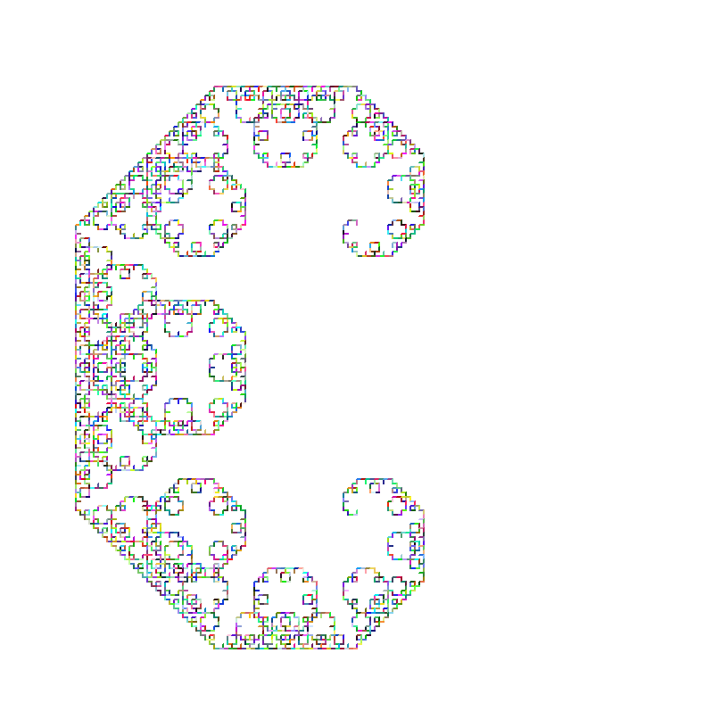
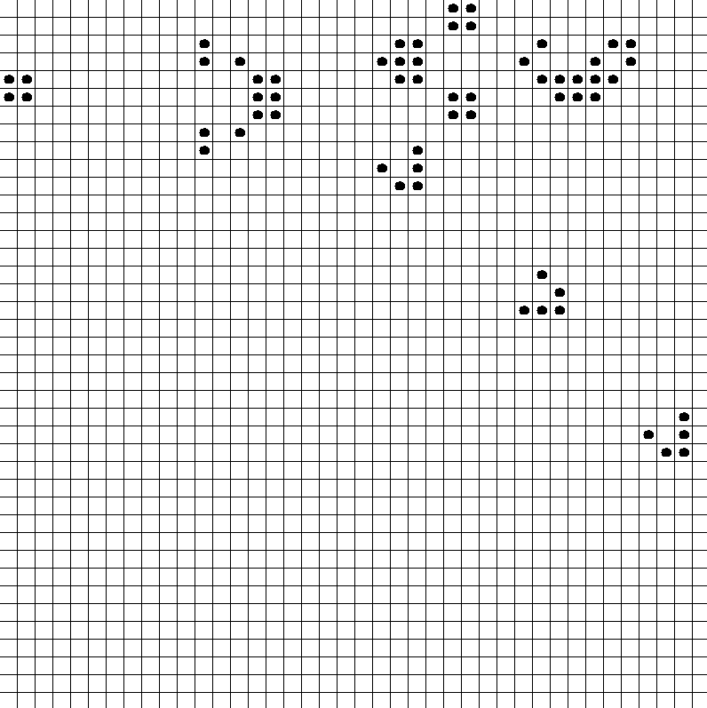

# TurtLM 

> Un langage de dessin style turtle, avec son interpréteur écrit en OCaml.

TurtLM permet de créer des dessins — du simple carré aux fractales et automates cellulaires — en pilotant un pinceau via un petit langage de programmation dédié : déplacements, rotations, conditions, boucles, fonctions récursives...

Le langage est [**Turing-complet**](https://fr.wikipedia.org/wiki/Turing-complet) : Tout ce qui est calculable/programmable/dessinable peut être, en théorie, calculé/programmé/dessiné

## Pourquoi ce projet ?

TurtLM n'est pas qu'un simple exécuteur de commandes de dessin : c'est un véritable petit langage de programmation, avec sa propre chaîne de compilation :

- **Lexer** généré avec OCamlLex
- **Parser** généré avec [Menhir](https://gallium.inria.fr/~fpottier/menhir/) ([grammaire](https://fr.wikipedia.org/wiki/Grammaire_non_contextuelle) LR)
- **Interpréteur** qui évalue l'AST et pilote l'affichage via la bibliothèque `Graphics`

Le projet illustre concrètement les étapes classiques d'un interpréteur (analyse lexicale -> syntaxique -> prétraitement -> évaluation), tout en offrant un résultat visuel immédiat.

## Fonctionnalités

-  Mode interactif (REPL) pour tester des instructions à la volée
-  Exécution de programmes depuis un fichier
-  Messages d'erreur de syntaxe précis (ligne, position, contexte)
-  Restauration après erreur en mode interactif (fini l'arrachage de checveux après un ";" manquant)
-  Boucles, conditions, fonctions récursives 

## Exemples

Le dossier [`sample/`](./sample) contient de nombreux programmes de démonstration, notamment :

- une **fractale** (`sample/fractal`)

- un **Gosper Glider Gun**, motif du [jeu de la vie de Conway](https://fr.wikipedia.org/wiki/Jeu_de_la_vie) (`sample/game_of_life`)




## Installation & compilation

Le projet utilise [Dune](https://dune.build/).

**Dépendances :** OCaml, Dune, Menhir, ocamllex, Graphics

```bash
dune build
```

## Utilisation

**Exécuter un programme :**

```bash
_build/default/main.exe sample/exemple1
```

**Mode interactif :**

```bash
_build/default/main.exe
```

Puis saisir directement les instructions du langage.

## Tests

Un script exécute l'ensemble des programmes de `sample/` et compare la sortie à celle attendue dans `sample_ans/` :

```bash
./test.sh
```

## Licence

Projet académique.